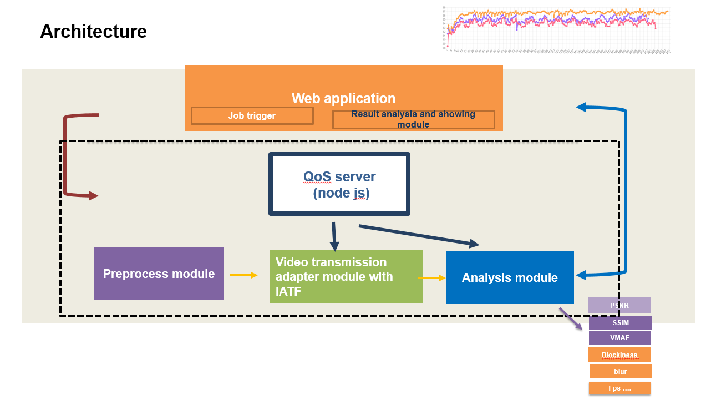
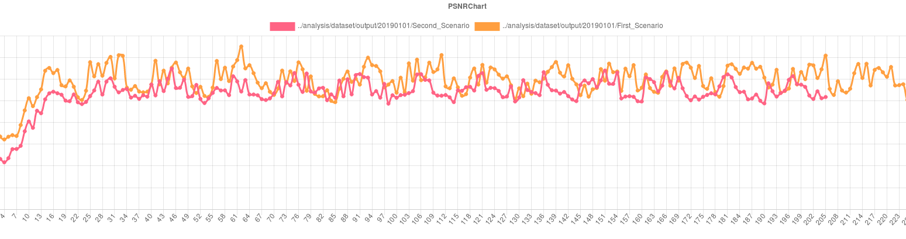

# QoS Test Framework
## Introduction
QoSTestFramework is a new test framework aims to provide comprehensive methodologies and indicators to assess the performance of real-time video system. It can also be combined with IATF( Interactive API Test Framework) to handle cross-platform and multi-device API test automation. 

## Architecture


## Design philosophy

- **Rich performance indicator**: Reference video quality indicators PSNR, SSIM and VMAF. Non-reference video quality indicators e.g. blockniess, blockloss, etc. Other related preformance indicators e.g. bandwidth, fps, etc.

- **High modular and scalable**: Each module can be run separately and integrated to your system easily.

- **Visualization of analysis result**: All analysis results can be viewed remotely. Visualization of comparative data for different test scenarios is supported as well.

## Structure introduction

Four major modules in the framework.

1. **QoS server** : It is responsible for handling requirement from web application. It is communication relay layer between web application and backend code, e.g trigger test task, stop the test and show the visualization test result on web page.
2. **Preprocess module**: Pre-process video for the whole pipeline, includes inserting handwriting digits to raw files and generate required format encoded files
3. **Analysis module**: Performance data result analysis , it included full-reference video quality indicate e.g PSNR, SSIM , VMAF and non-reference video quality indicate e.g blockniess, blockloss etc, and other network status e.g bandwidth , fps etc.
4. **Web Application**: Trigger Test task and visualize for analysis result.
5. **Video transmission adapter module**: Video transmission channel which is the adaptation layer for different real-time video system, we provide the example with Open WebRTC Toolkit linux SDK.


## Install guide

## Preprocess module setup
This section describes the dependencies and steps for setup Preprocess module, all scripts and code can be found at pre-process folder.

### Install dependencies
To enable the deep learning module, you should compile the latest OpenCV and the OpenCV_contrib modules. We recommend version 4.1.0. Refer to https://opencv.org for the details and installation.
To use the FFmpeg you should compile the FFmpeg toolset. You can refer to the script `preprocess/encodedVideoGenerateScripts/compile_ffmpeg.sh`. And use the script to install the toolset.

### Generate tagged file as testing input video
Two types of video stream format, raw file and encoded file, as input video source are provided.

#### Raw file:
1. Generate tagged hand-writing digits avi file:
``` bash
tag input.y4m tagged.avi resolution_width resolution_height tagsize framenumber
```
*eg ./tag ./video/FourPeople_1280x720_60.y4m FourPeople_1280x720_30_tagged.avi 1280 720 3 600*

It will generate FourPeople_1280x720_30_taged.avi in native output folder, whose resolution is 1280x720, one number tag size width is 20*3, total frame numberr is 600.

2. use `ffmpeg` to generate requested input format video
You can refer to the script `preprocess/encodedVideoGenerateScripts/compile_ffmpeg.sh`. And use the script to install the toolset.
```
ffmpeg -i tagged.avi tagged.yuv
```
*eg ffmpeg -i FourPeople_1280x720_30_taged.avi FourPeople_1280x720_30_taged.yuv*
It will generate FourPeople_1280x720_30_taged.yuv

#### Encoded file:
1. Generate mkv file
```
Python mkTestStream.py –w <width> -h <height> -b <bitrate> -o <output.mkv> -v <codec> <input_stream>
```
*e.g ./mkTestStream.py -w 1280 -h  720 -b 2000 -o 1280x720-framerate30-vp8_bitrate1000k.mkv -v vp8 1280x720_30_taged.avi*

It will generate encoded mkv file 1280x720-framerate30-bitrate1000k.mkv
2. Insert key frame and tag information to encoded video file
Run the `compile_ffmpeg.sh` script to compile the ffmpeg libs and build the `genTestStream` tool.
```
./genTestStream -i <MKV file>
```
*e.g ./genTestStream -i 1280x720-framerate30-vp8_bitrate1000k.mkv*

It will generate corresponding encoded key frame and tag information format encode file , end with vp8/h264/vp9/h265

**This file format is "key frame"+ "frame length"+"tag"+"frame data"**

3. Decode encoded file to raw file for comparison
```
ffmpeg  -i <MKV file> -c:v rawvideo -pix_fmt yuv420p <Decoded file>
```
*e.g ffmpeg -i FourPeople_720p_taged_H264.mkv -c:v rawvideo -pix_fmt yuv420p FourPeople_720p_taged_H264_decoded.yuv*

It will decode FourPeople_720p_taged_H264.mkv to FourPeople_720p_taged_H264_decoded.yuv

## Analysis module setup
Analysis module help to do performance data result analysis included reference video quality indicators, e.g PSNR, SSIM, VMAF and non-reference video quality indicators, e.g. blockniess, blockloss etc.
### Install Dependencies
To enable VMAF, clone the VMAF repo from the github and install all the requirements as instructed in https://github.com/Netflix/vmaf and finally "`make`".

To enable non-reference indicator, please go to http://vq.kt.agh.edu.pl//metrics.html to download executable binary and found detail description about each non-reference video quality indicators.

To compile analysis module in src folder, you should compile the latest OpenCV and the OpenCV_contrib modules and install FFmpeg tool at first, 
Please refer to script `preprocess/encodedVideoGenerateScripts/compile_ffmpeg.sh` to install FFmpeg toolset. For OpenCV, we recommend version 4.1.0. Refer to https://opencv.org for the detailed installation steps.

### Generate analysis data
Generally speaking, the data which need to analyze is generated by Video transmission adapter module which included sender video, received video frame sequence ARGB data, timestamp for each sender/receviced video frame, real-time network consumption, fps data.
1. Generate aligned send/received video sequence using recevived video ARGB data and sender video stream by iq_yuv, it calculate full reference video quality PSNR and SSIM results as will.
```
iq_yuv <ARGBrawFile> <originalVideoFile> <width> <height>
```
*e.g iq_yuv localARGB.txt FourPeople_720p_taged.yuv 1280 720*

2. Video Quality indicator using VMAF algorithm 
```
python /path/to/vmaf_calculate.py
```
*e.g python analysis/python/vmaf_calculate.py*

3. video Quality indicator using NON-reference video algorithm
```
python /path/to/NR_calculate.py
```
*e.g python analysis/python/NR_calculate.py*

It will test the quality use no-reference video quality assessment algorithm and generate result data.

4. Freeze ratio, length and number of freezes
```
python ./analysis/python/freeze_ratio.py <video-file> 
````
*e.g python ./analysis/python/freeze_ratio.py ./analysis/dataset/output/cut.mp4*

Currently, it only support encoded video format. It can generate the freeze_ratio and length of freezes, please check front-end visualization results.  

5. Caculate latency
```
latency {publishTimeFile} {latencyFile} {frameCount}
```
*e.g ./analysis/native/latency localPublishTime.txt localLatency.txt 600*

It will calculate the latency result

6. Calculate fps
```
fps {FpsFile}
```
*e.g ./analysis/native/fps localFps.txt*

It will calculate the fps result

7. Calculate jitter
```
FLR {latencyFile}
```
*e.g ./analysis/native/FLR localLatency.txt*

It will calculate the jitter result

8. Calculate bitrate
```
bitrate {bitrateFile}
```
*e.g ./analysis/native/bitrate localBitrate.txt*

It will calculate the fps result

**All result data can be visualized in QOS server page**

## Video transmission adapter module
Video transmission adapt module help to establish SUT (system under testing) transmission channel and generate corresponding performance input data for Analysis module. We provide one simple sample named QoStestclient which use linux SDK of Open WebRTC Toolkit to testing performance for Open WebRTC Toolkit owt-server conference mode.

#### Sample with Open WebRTC Tookit server and Client
1. Start Open WebRTC Tookit Conference Server

Please following instruction at https://github.com/open-webrtc-toolkit/owt-server to start Conference Server

2. Build Open WebRTC Toolkit Native SDK

Please follow instructions at https://github.com/open-webrtc-toolkit/owt-client-native to build Open WebRTC Toolkit Native SDK.

3. Build QoStestclient

Go to QoStestclient directory run following commands

```
mkdir build
cd build
cmake ../
make
```

4. Run QoStestclient

Please following steps defined in QOStestclient/README file .

#### QoS server and web application setup and usage
QoS server triggers test task and visualizes the analysis result. The result can be showed in two ways. 1. analysis and show the single indicator directly at web page. 2. generate and show comparison results

##### Install Dependencies and start QOS server

Install latest nodejs >12 and node modules. Please refer to https://nodejs.org/en/download/ for install nodejs in your system. 
And,use npm to install the modules, eg. `‘npm install’`.

Replace cert.pem and key.pem in certs folder, please "DON'T" use sample cert.pem and key.pem to deploy QoS Server in public network.
  
After install runtime environment and necessary modules, start the server with:
```
node qosServer.js
```
It will generate new sample services ID and key at server side when the QosServer server is launched.  Please input this service ID and key in web application page. Only certified user request can reach to server. It can help you set up secure access mechanism between web application and server.
Note: Please replace and use customized security access mechansim by yourself e.g account , userpassword etc if you want deploy the system in public network.

##### Web application setup and usage
After you run the analysis steps described in 1.1.2.2-2, the result file will locate in `analysis/dataset/out`, and you should create your own subfolder and move all the result file in it.

Create your own subfolder in the `analysis/dataset/`out folder
```
cd {analysisOutFolder}
mkdir –p {date}/{testnumber}
```
*eg:<br>
cd analysis/dataset/out<br>
mkdir –p 20190501/1*

this will create the necessary directory structure

**single indicator visualization**

After that you can visit https://localhost:4004 to get visualization result for each indicators.
here is example result for SSIM data 


**multi indicators compared visualization**

To see the comparison results, you can visit https://\<qosServerAddress\>:4004/qostestframework_summary.html to get the result for each indicators. It will compare data with different “testnumber” in the same “data” dir which created in last step.


